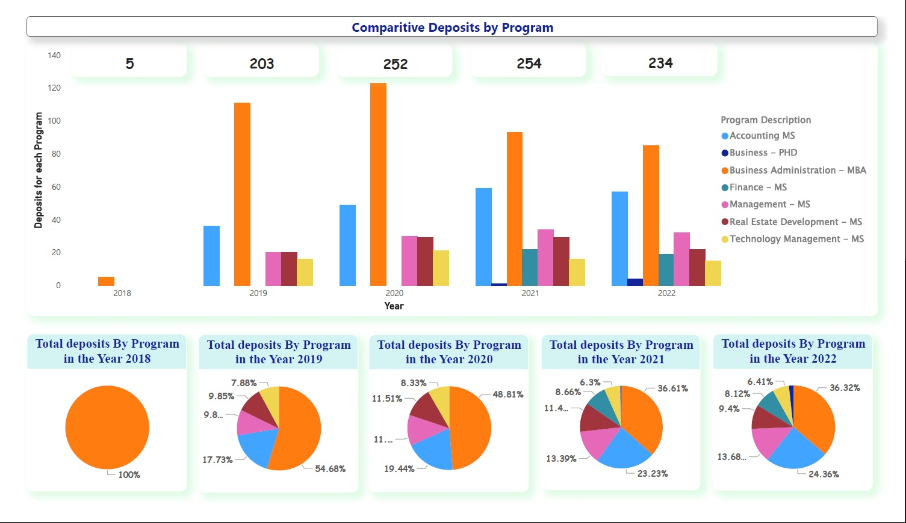
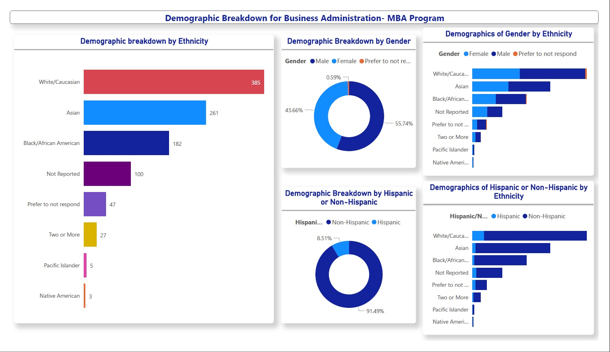

# Data Analysis with Power BI : Admission Data

The dataset mainly consists of details of students with the following features:
- Contact ID
- Start_Term_and_Year
- Program_Desc
- IPEDS_Ethnicities
- IPEDS_Hispanic
- Sex
- Created_Date
- Complete_Date
- Admit_Date
- Deposit_Date

In this we are trying to show:
1.  **Comparative deposits by program on monthly or yearly basis**
    

2.  **The demographic breakdown of one program**
    
The data analysis revealed some of the  values in Program_Desc repeated with some errors.
The errors is handled using text-distance such as Levinshtein Distance, cosine similarity or Jaccard distance.

- For this case, I have used Jaccard distance.
- The Jaccard distance is computed by subtracting the Jaccard coefficient from one, or by dividing the difference in the sizes of the union and the intersection of two sets by the size of the union.

Overall , Business Administration demonstrated highest annual admission rates and hence the demographics of it as show above. 
 
